# SolarSense — Solar SCADA Intelligence & Power Forecasting Platform

**A nine-stage SCADA analytics and machine-learning pipeline over 136,472 synchronized telemetry records from two utility-scale solar farms — meteorological gap imputation, inverter health diagnostics, and sub-hourly AC power forecasting.**

[](https://www.python.org)
[](https://flask.palletsprojects.com)
[](https://scikit-learn.org)
[](LICENSE)

---

## Project Overview

Real-world solar SCADA data is messy: sensors drop readings at irregular intervals, inverters degrade at different rates, and power generation tracks a complex non-linear function of irradiance, temperature, and time-of-day. SolarSense treats this as a full-stack data engineering problem.

The platform ingests four raw CSV telemetry streams from two Indian utility-scale solar plants (Plant 4135001 and Plant 4136001), applies a physics-grounded 3-tier imputation strategy to fill missing weather sensor intervals, computes inverter health diagnostics via the Inverter Performance Index (IPI), and trains three regression models to forecast sub-hourly AC power generation — serving everything from a live Flask web application with nine interactive pipeline stages.

---

## Features

### SCADA Data Intelligence
- **Two-plant support** — switch between Plant 1 and Plant 2 in-app; all metrics update live from real data.
- **3-tier weather imputation** — time-linear spline for short gaps (≤ 1 hr), diurnal profile matching for long daytime gaps (> 1 hr), zero-clamp for night gaps. Benchmarked against ground-truth holdout (spline RMSE 0.108 kW/m² for irradiance).
- **Gap Audit Log** — every contiguous missing-interval event is catalogued: start time, end time, duration, time of day, and strategy applied.
- **Inverter Performance Index (IPI)** — benchmarks each of 22 string inverters' average daily yield against the plant median; flags units below 90% IPI for soiling/fault investigation.

### Machine Learning Pipeline
- Temporal 80/20 chronological holdout split — no shuffling, no leakage.
- Three regression candidates: Ridge (linear baseline), Random Forest, HistGradientBoosting.
- Champion selected by highest out-of-sample R² on sealed holdout.
- **HistGradientBoosting champion**: R² = 0.9625, MAE = 28.77 kW on sealed test.
- Ridge surrogate coefficients exported for per-prediction linear feature attributions (without SHAP).

### Prediction Interface
- Input 6 environmental/temporal features → get AC power forecast in kW.
- Estimated 15-minute energy yield (kWh slice).
- Feature contribution breakdown (Ridge linear attribution map) with boost/reduce indicators.
- Model picker: choose the champion or any candidate, with live R² score shown.

### Visualization (9 Chart Types)
- 8 SCADA feature distributions (daylight-filtered for generation channels).
- 4 z-score standardized histograms.
- 8×8 correlation heatmap (amber/red heat scale).
- Influence-on-target bar (correlation to AC power).
- Diurnal dual-axis curve (AC power + DC power + irradiance vs hour).
- IPI ranked bar chart (all 22 inverters color-coded by health status).
- Imputation benchmark grouped bar (3 sensors × 3 strategies).
- Model comparison R² bar.
- Predicted vs Actual AC power scatter plot (300-point sample).

### JSON API
- `POST /api/predict` — AC power forecast with feature contributions.
- `GET /api/bundle` — full EDA bundle for the active plant.

---

## Dataset

Four CSV telemetry streams collected over **34 consecutive days** (May 15 to June 17, 2020) at **15-minute intervals** across two solar plants:

| File | Rows | Description |
|------|------|-------------|
| `Plant_1_Generation_Data.csv` | 68,774 | DC/AC power, daily/total yield — 22 inverters |
| `Plant_1_Weather_Sensor_Data.csv` | 3,182 | Irradiation, ambient temp, module temp |
| `Plant_2_Generation_Data.csv` | 67,698 | DC/AC power, daily/total yield — 22 inverters |
| `Plant_2_Weather_Sensor_Data.csv` | 3,259 | Irradiation, ambient temp, module temp |

### Sensor Channel Dictionary

| Channel | Unit | Physical Role |
|---------|------|---------------|
| `DC_POWER` | kW | Direct current from PV string arrays |
| `AC_POWER` | kW | Inverter AC output to grid (target) |
| `DAILY_YIELD` | kWh | Cumulative generation since dawn (resets midnight) |
| `TOTAL_YIELD` | kWh | Lifetime inverter energy counter |
| `IRRADIATION` | kW/m² | Global Horizontal Irradiance (GHI) |
| `AMBIENT_TEMPERATURE` | °C | Air temperature at weather station |
| `MODULE_TEMPERATURE` | °C | PV surface thermocouple |
| `TEMP_DIFF` | °C | Derived: Module − Ambient (thermal stress) |

### Data Quality Notes

**Plant 1 scale anomaly**: Raw DC power was recorded at 10× electrical scale (mean daylight DC = 3,147 kW vs AC = 307.8 kW). The `merge_and_enrich` function divides Plant 1 DC by 10 before computing efficiency. Both plants then show identical baseline efficiency of **97.7%**.

**Missing intervals**:

| Plant | Missing Intervals | Coverage |
|-------|-----------------|----------|
| Plant 1 | 82 of 3,264 | 97.49% |
| Plant 2 | 5 of 3,264 | 99.85% |

---

## The Missing Data Problem & Imputation Solution

### Why sensor gaps cannot be standardized

SCADA weather sensor readings are nominally at 15-minute cadence, but:
- **Gap length varies per event** — sensor resets, network timeouts, and power failures create gaps of 1 slot (15 min) up to several hours. No fixed formula handles all cases.
- **Time-of-day changes everything** — a night gap (irradiance is physically zero) needs different treatment than a midday gap during peak irradiance.
- **Non-uniform across days** — gaps don't occur at predictable offsets; one day may have 2 morning gaps, the next day is clean, the one after has a 2-hour afternoon blackout.

### 3-Tier Imputation Policy

| Condition | Strategy | Validated RMSE (Irradiance) |
|-----------|----------|-----------------------------|
| Night gap (hour < 6 or > 18) | **Zero-clamp** | 0.000 (physically exact) |
| Daytime, ≤ 4 slots (≤ 1 hr) | **Time Linear Spline** | **0.108 kW/m²** (best) |
| Daytime, > 4 slots (> 1 hr) | **Diurnal Profile Matching** | 0.165 kW/m² |
| Forward Fill (baseline) | — | 0.130 kW/m² |

The benchmark simulates a 10% random daytime dropout on observed data, applies each strategy, and measures reconstruction error against ground truth. Linear spline wins on both MAE and RMSE for all sensor channels.

**This imputation is applied before training** — weather data is fully reindexed to the complete 15-minute grid, gaps filled by the 3-tier policy, then merged with generation data. Models train on complete, imputed streams.

---

## ML Pipeline

```mermaid
flowchart LR
    A[4 CSV SCADA Streams] --> B[Parse & Validate Timestamps]
    B --> C[3-Tier Weather Imputation\nspline · diurnal · zero-clamp]
    C --> D[Merge Generation + Weather\ninner join on DATE_TIME + PLANT_ID]
    D --> E[Feature Engineering\nTEMP_DIFF · HOUR · MINUTE · IS_DAY]
    E --> F[Daylight Filter\nIS_DAY = True only]
    F --> G[Temporal 80/20 Split\nchronological — no shuffle]
    G --> H[Train 3 Candidates\nRidge · RF · HistGB]
    H --> I[Evaluate on Sealed Holdout\ntouched exactly once]
    I --> J[Serve via Flask\nweb app · JSON API]
```



### 9-Stage Pipeline

| # | Stage | What it shows |
|---|-------|---------------|
| 01 | Upload Dataset | Plant 1 / Plant 2 switcher, dataset summary cards, imputation status |
| 02 | Analyse Features | Full sensor channel dictionary, 22-inverter hardware registry |
| 03 | Descriptive Statistics | Mean/std/min/max for 8 channels — overall, daylight, night split |
| 04 | Missing Value Analysis | 3-tier policy, benchmark table, imputation RMSE chart, gap audit log |
| 05 | Data Visualization | 8 distributions, 4 z-score, correlation heatmap, diurnal curve, IPI bar |
| 06 | Preprocessing | Imputation policy recap, feature engineering, temporal split rationale |
| 07 | Model Training | 3 candidates with full metrics (R², MAE, RMSE, MAPE), champion badge |
| 08 | Model Evaluation | Predicted vs actual scatter, feature importance, Ridge coefficient table |
| 09 | Predict Generation | 6-input forecast form, AC kW result, feature contributions, model picker |

---

## Model Results

Sealed temporal holdout (20% most-recent daylight records):

| Model | R² | MAE (kW) | RMSE (kW) | Daylight MAPE |
|-------|-----|----------|-----------|---------------|
| Ridge Regression | 0.8741 | 46.23 | 68.54 | 18.2% |
| Random Forest | 0.9571 | 29.85 | 41.17 | 9.8% |
| **HistGradientBoosting (Champion)** | **0.9625** | **28.77** | **38.93** | **9.1%** |

**Why HistGradientBoosting wins**: Ridge confirms measurable non-linearity in the irradiance-power curve (thermal saturation, clipping); tree ensembles model this natively. HistGB additionally handles the non-monotonic temperature derating interaction more precisely than the bagged forest.

**Feature importance (Gini, Random Forest)**:

| Feature | Importance |
|---------|-----------|
| IRRADIATION | ~52% |
| HOUR | ~22% |
| MODULE_TEMPERATURE | ~10% |
| TEMP_DIFF | ~8% |
| MINUTE | ~5% |
| AMBIENT_TEMPERATURE | ~3% |

---

## System Architecture

```
Browser ──► Flask app (Jinja SSR — 9 live pipeline stages)
  │             │
  │             ├── eda.py    imputation engine + EDA bundle (in-memory LRU cache)
  │             └── model.py  temporal split, train 3 candidates, evaluate, infer
  │
  └──► JSON API — /api/predict · /api/bundle
```

`eda.py` runs the full 3-tier imputation, merges datasets, and computes the EDA bundle once per plant — cached in an in-memory LRU keyed by plant number. `model.py` calls `eda.impute_weather_gaps()` before training, caches the artifact by plant, and exposes a `predict()` function that returns kW forecast + Ridge attribution explanations.

---

## Project Structure

```
Solar_Sense/
├── flask_project/
│   ├── app.py              # Routes, JSON API, plant switcher
│   ├── eda.py              # Imputation engine + EDA bundle computation
│   ├── model.py            # Temporal split, training, evaluation, inference
│   ├── data/               # 4 SCADA CSVs + cached joblib artifacts
│   ├── static/
│   │   ├── css/style.css   # Design system (Inter + IBM Plex Mono, amber palette)
│   │   └── js/charts.js    # 9 Chart.js chart builders
│   └── templates/          # 12 Jinja2 templates (base + 9 pipeline stages + pager)
├── solarsense_report.tex   # Full 9-section LaTeX technical report
├── Plant_1_Generation_Data.csv
├── Plant_1_Weather_Sensor_Data.csv
├── Plant_2_Generation_Data.csv
└── Plant_2_Weather_Sensor_Data.csv
```

---

## Tech Stack

| Layer | Technology |
|-------|------------|
| Language | Python 3.11+ |
| Backend | Flask 3 (Jinja2, Werkzeug) |
| Machine Learning | scikit-learn ≥ 1.4 — Ridge · RandomForestRegressor · HistGradientBoostingRegressor; joblib artifacts |
| Data Processing | pandas ≥ 2.0, NumPy |
| Frontend | Server-rendered Jinja2, vanilla JS, Chart.js 4.4.3 (jsDelivr CDN), custom CSS (Inter + IBM Plex Mono, amber design system) |
| Version Control | Git + GitHub |

---

## Installation

Requires **Python 3.11+**:

```bash
git clone <your-repo-url>
cd Solar_Sense

python -m venv .venv
# Windows:
.venv\Scripts\activate
# Linux / macOS:
source .venv/bin/activate

pip install flask>=3.0 scikit-learn>=1.4 pandas>=2.0 numpy>=1.26 joblib>=1.2
```

---

## Running Locally

```bash
python flask_project/app.py
# → http://127.0.0.1:5000
```

On first visit to a model stage (Train / Evaluate / Predict), the app trains all three models (~30–90 s depending on hardware), then caches artifacts to disk — subsequent visits are instant. EDA pages are instant on every visit.

---

## API Documentation

### `POST /api/predict`

```bash
curl -X POST http://127.0.0.1:5000/api/predict \
  -H "Content-Type: application/json" \
  -d '{
    "plant_num": 1,
    "model_name": "HistGradientBoosting",
    "values": {
      "IRRADIATION": 0.85,
      "MODULE_TEMPERATURE": 52.0,
      "AMBIENT_TEMPERATURE": 38.0,
      "TEMP_DIFF": 14.0,
      "HOUR": 12,
      "MINUTE": 30
    }
  }'
# → {"ac_power_kw": 287.43, "daily_yield_est_kwh": 71.86,
#    "model_used": "HistGradientBoosting", "r2_score": 0.9625,
#    "explanations": [...]}
```

All values fields are optional (absent → training median). `plant_num` defaults to the active session plant.

### `GET /api/bundle`

Returns the full EDA bundle for the active plant (overview, features, descriptive stats, imputation lab results, histograms, heatmap, diurnal, inverters).

---

## Limitations

- The dataset covers only **34 days** (May–June 2020) — seasonal generalization is limited.
- **Weather sensors are plant-level** (one station per plant), not string-level, so localized micro-shading effects are invisible to the model.
- Imputation is validated by simulation — the actual gap events are not ground-truth verified beyond sensor continuity.
- The decision threshold for IPI fault detection (90%) is a rule-of-thumb, not a statistically calibrated threshold.
- No fairness or adversarial robustness audit has been performed.

---

## Future Improvements

- NWP (Numerical Weather Prediction) irradiance integration for 24-hour-ahead forecasting
- LSTM / Transformer models for multi-step temporal dependencies
- Automated soiling detection with PELT/BOCPD change-point detection on IPI time series
- Cross-plant transfer learning (Plant 1 → Plant 2 fine-tuning)
- Conformal prediction intervals for uncertainty quantification
- Docker + Render deployment (Dockerfile + render.yaml)
- GitHub Actions CI (pytest + pip-audit)

---

## License

MIT — see [LICENSE](LICENSE).

---

*Built as part of a 12-week classical-ML self-learning track (25SC2107E, KL Deemed to be University). EDA → imputation → regression → deployment.*
