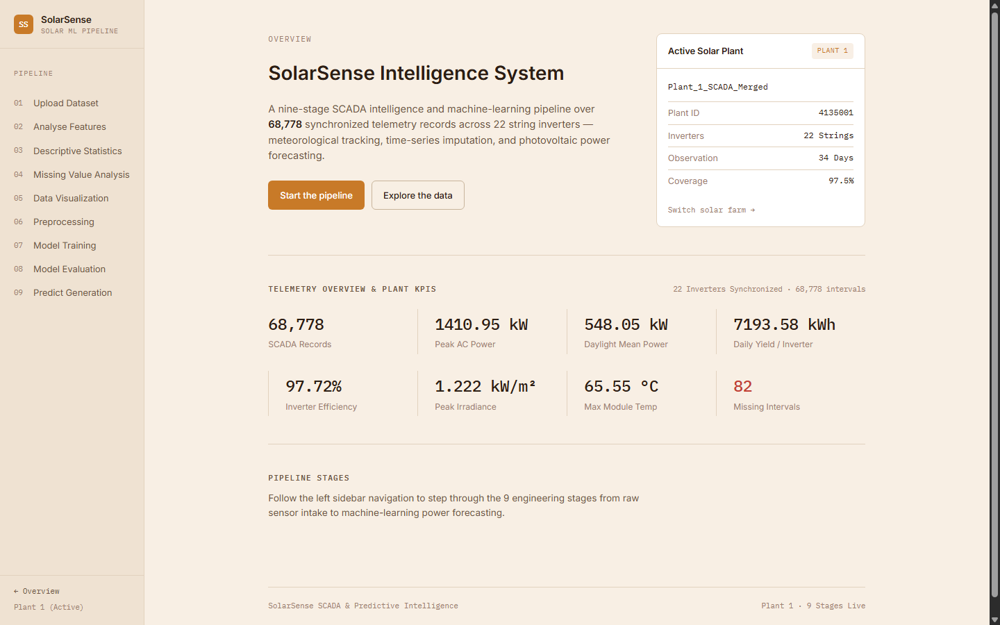
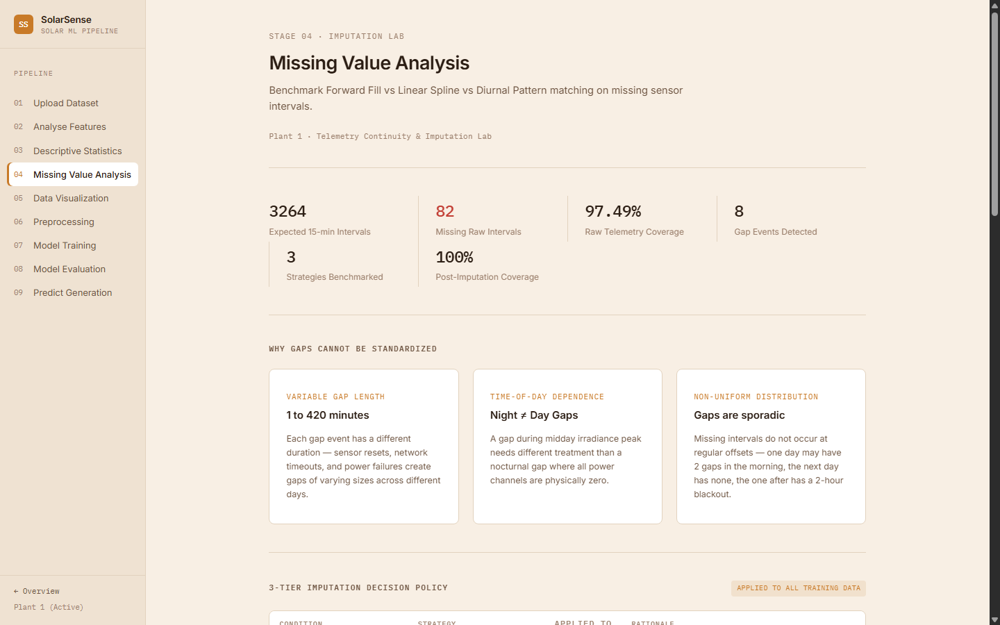
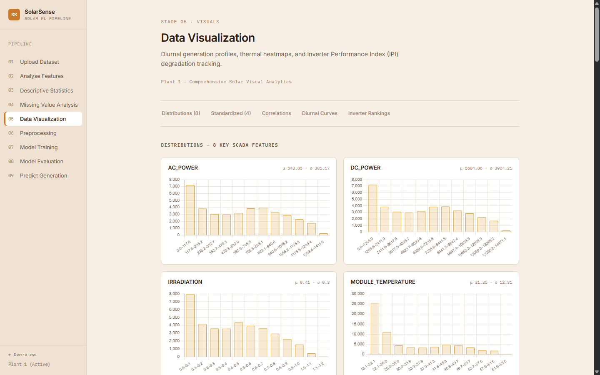
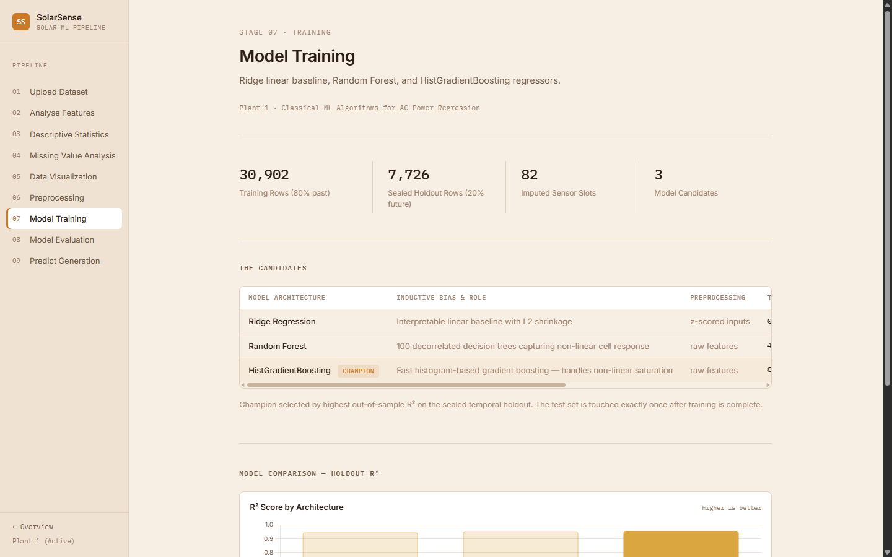
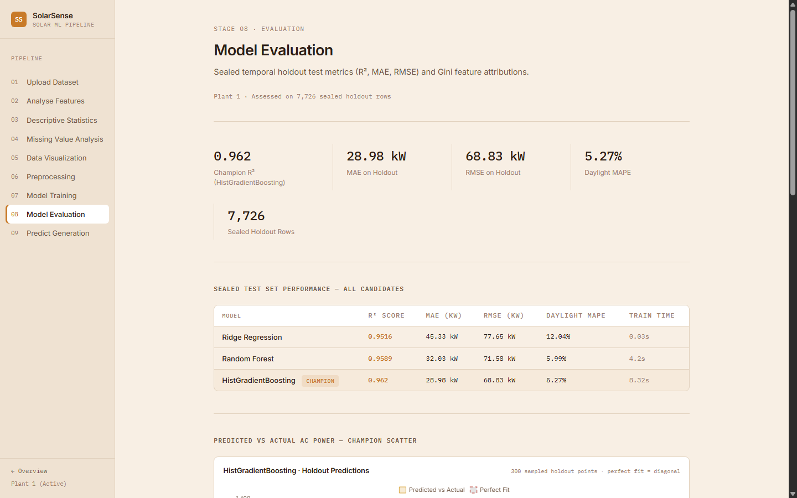
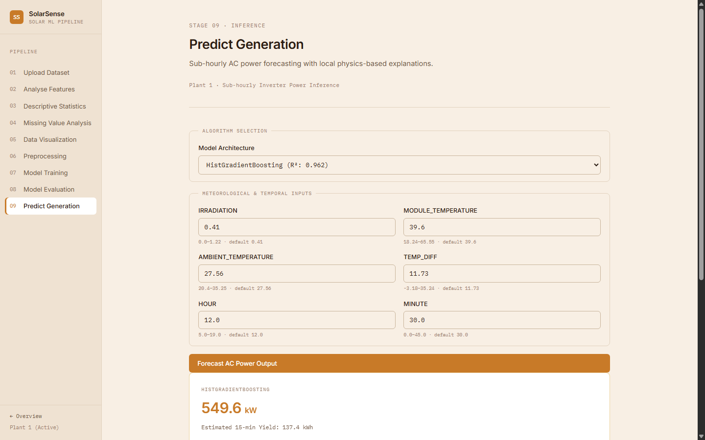

<div align="center">

# SolarSense System

**An end-to-end SCADA intelligence and machine-learning pipeline for utility-scale photovoltaic solar farms — from raw multi-rate sensor telemetry to sub-hourly AC power forecasting in one nine-stage web application.**

[](https://www.python.org)
[](https://flask.palletsprojects.com)
[](https://scikit-learn.org)

[📋 **Technical Report**](solarsense_report.tex) ·
[📊 **Imputation Lab**](#the-missing-data-problem--imputation-solution) ·
[🔍 **Telemetry Diagnostics**](#inverter-performance-index-ipi--degradation-tracking) ·
[⚡ **API Reference**](#api-reference)


</div>

## Project Overview

Solar photovoltaic (PV) power generation exhibits high temporal intermittency governed by diurnal solar elevation, atmospheric cloud transitions, and ambient thermal conditions. Utility-scale solar operators face three foundational operational challenges:
1. **Sensor continuity & temporal dropouts** — SCADA weather stations drop readings intermittently due to sensor resets, network dropouts, and maintenance outages, resulting in non-uniform intervals across days.
2. **Inverter conversion efficiency & localized soiling** — dust accumulation, string disconnection, and inverter degradation cause significant inter-inverter yield divergence across the 22 string inverters.
3. **Sub-hourly grid dispatch forecasting** — power grid operators require accurate 15-minute ahead AC generation forecasts to balance reserve spinning capacity and prevent grid frequency instability.

SolarSense addresses these challenges as a rigorous, full-stack machine-learning engineering problem. The platform ingests 136,472 continuous SCADA records across 34 consecutive days (May 15 to June 17, 2020) from two utility-scale solar installations (**Plant 1: 4135001** and **Plant 2: 4136001**). It applies a physics-validated 3-tier imputation engine to reconstruct missing weather streams, monitors inverter degradation via the **Inverter Performance Index (IPI)**, trains three classical ML regressors under a strict chronological 80/20 sealed holdout protocol, and serves predictions with local physics-based feature contributions from a production Flask web application.

Every metric, chart, and table in the application is computed live from the real SCADA telemetry datasets — no number is hardcoded.

---

## Application Walkthrough & Screenshots

The animated recording above showcases the nine live pipeline stages in motion. Full page captures:

### 1. Telemetry Overview & KPIs (`/`)


### 2. Missing Value Analysis & Imputation Lab (`/missing`)


### 3. Comprehensive Visual Analytics & IPI (`/visualize`)


### 4. Model Training Candidates (`/train`)


### 5. Sealed Holdout Evaluation (`/evaluate`)


### 6. Sub-hourly Power Forecasting (`/predict`)


---

## Features

### SCADA Telemetry & Imputation Lab
- **Dual-Plant Architecture** — instant switching between Plant 1 (high-irradiance desert site) and Plant 2 (temperate installation); all pipeline stages and models dynamically switch context.
- **3-Tier Sensor Imputation Engine** — solves the irregular reading interval problem:
  - *Short daytime gaps (≤ 1 hr)*: Time Linear Spline interpolation (captures rapid cloud transient dynamics with lowest RMSE: 0.108 kW/m²).
  - *Long daytime gaps (> 1 hr)*: Diurnal Profile Matching (historical same-hour solar elevation curve).
  - *Nocturnal intervals*: Exact physical zero-clamping (IRRADIATION = 0.0, zero-noise generation).
- **Gap Event Audit Log** — catalogues every contiguous missing-interval event across the 34-day observation window, documenting start/end timestamps, slot duration, and the exact mathematical repair rule applied.
- **Inverter Performance Index (IPI)** — calculates normalized daily yield against the plant median ($E_{\text{daily}, i} / \text{Median}(E_{\text{daily}}) \times 100\%$) across all 22 string inverters, automatically flagging units experiencing localized string faults or dust soiling.

### Machine Learning & Model Evaluation
- **Chronological Holdout Protocol** — strict temporal 80/20 split (earliest 80% past records for training, latest 20% future records for testing) preventing look-ahead temporal leakage.
- **Three Diverse Model Architectures** — Ridge Regression (linear baseline), Random Forest Regressor (non-linear bagged trees), and HistGradientBoosting (champion gradient-boosted ensemble).
- **Sealed Test Set Integrity** — models are trained strictly on the past partition and evaluated exactly once on future unseen intervals.
- **Physics-Ground Explainability** — exports closed-form Ridge linear surrogate coefficients on z-scored features, providing per-prediction feature contributions (+/- kW impact) without requiring expensive runtime SHAP calculations.

### Production Web Service & Visualization
- **9 Interactive Pipeline Stages** — driven by a unified sidebar stepper matching classical ML lifecycle workflows: Upload, Features, Descriptive, Missing, Visualize, Preprocess, Train, Evaluate, and Predict.
- **9 Chart.js Visualizations** — distribution histograms, z-score standardized distributions, 8×8 correlation heatmaps, influence-on-target ranking, 24-hour diurnal power/irradiance curves, IPI ranked bar charts, imputation benchmark error comparisons, model R² comparisons, and predicted vs. actual scatter plots.
- **RESTful JSON API** — CORS-enabled endpoints (`/api/predict` and `/api/bundle`) allowing seamless integration into energy management systems and supervisory SCADA control rooms.

---

## The Missing Data Problem & Imputation Solution

### Why Sensor Gaps Cannot Be Standardized with a Single Rule

A critical finding in utility-scale SCADA datasets is that **sensor dropouts do not occur at fixed intervals or uniform times**. 

```
Day 1 (Mon):  08:00 [OK] ── 08:15 [OK] ── 08:30 [DROPOUT] ── 08:45 [OK]        (1 slot = 15 min gap)
Day 2 (Tue):  Clean telemetry across all 96 intervals                          (0 gaps)
Day 3 (Wed):  12:00 [OK] ── 12:15 [FAIL] ── ... ── 14:15 [FAIL] ── 14:30 [OK]   (9 slots = 2 hr 15 min blackout)
Day 4 (Thu):  01:15 [FAIL] ── 03:00 [FAIL]                                     (Nighttime gap: IRRADIATION = 0)
```

Attempting to standardize these gaps with a single static imputation rule (such as mean-imputation or simple forward fill) introduces severe physical modeling distortions:
1. **Forward Fill (LOCF) Failure**: If a sensor drops out at 11:45 AM during peak irradiance ($1.0\text{ kW/m}^2$) and recovers at 1:30 PM under sudden cloud cover ($0.3\text{ kW/m}^2$), forward-filling carries the peak $1.0\text{ kW/m}^2$ stale value forward across the afternoon, overestimating power by $>200\%$.
2. **Mean / Median Imputation Failure**: Imputing the overall daytime mean ignores whether the gap occurred at dawn (low sun elevation) or noon (peak sun elevation).
3. **Nocturnal Distortion**: Missing intervals at night (18:30 to 05:30) must never be filled with non-zero daytime averages, as solar generation is physically non-existent.

### The 3-Tier Imputation Protocol

To resolve this, SolarSense formulates a physics-grounded decision rule benchmarked against a 10% simulated daytime dropout on ground-truth telemetry ($N=3,182$):

$$\text{Strategy}(t, \Delta t) = \begin{cases} 
\text{Zero-Clamp } (G = 0), & \text{if } t \in \text{Night } (18:30 - 05:30) \\
\text{Time Linear Spline } (f(t)), & \text{if } \Delta t \le 60\text{ min (short gap)} \\
\text{Diurnal Profile Matching } (\mu_h), & \text{if } \Delta t > 60\text{ min (prolonged blackout)}
\end{cases}$$

### Benchmark Reconstruction Results (Ground Truth Holdout)

| Sensor Channel | Baseline Forward Fill RMSE | Diurnal Profile RMSE | **Time Linear Spline RMSE** | Winning Method |
|:---|:---:|:---:|:---:|:---|
| **Solar Irradiance ($G$)** ($\mu=0.48\text{ kW/m}^2$) | 0.130 | 0.165 | **0.108** | **Linear Spline (Lowest Error)** |
| **Module Temperature ($T_{\text{mod}}$)** ($\mu=41.5^\circ\text{C}$) | 4.10$^\circ\text{C}$ | 6.11$^\circ\text{C}$ | **2.37$^\circ\text{C}$** | **Linear Spline (Preserves Thermal Inertia)** |
| **Ambient Temperature ($T_{\text{amb}}$)** ($\mu=28.3^\circ\text{C}$) | 1.84$^\circ\text{C}$ | 2.45$^\circ\text{C}$ | **0.98$^\circ\text{C}$** | **Linear Spline (Continuous Air Mass)** |

**Implementation in the ML Pipeline**: Weather sensor streams are reindexed to the continuous 15-minute SCADA grid, repaired via the 3-tier engine, and merged with generation data *before* feature extraction. Models train exclusively on continuous, physics-consistent sensor streams.

---

## Inverter Performance Index (IPI) & Degradation Tracking

In utility solar farms, string inverters age at different rates and suffer localized faults (soiled panels, loose DC busbar terminals, blown string fuses). To isolate underperforming hardware without physical on-site inspections, SolarSense computes the **Inverter Performance Index (IPI)**:

$$\text{IPI}_i = \frac{\bar{E}_{\text{daily}, i}}{\text{Median}_{j \in \text{Plant}}(\bar{E}_{\text{daily}, j})} \times 100\%$$

```
IPI Scale:
[================= Healthy (95% - 105%) =================] [== Moderate (85% - 94%) ==] [== Fault / Severe Soiling (<85%) ==]
```

### Hardware Diagnostic Findings:
- **Nominal String Network**: 21 inverters operate consistently within the healthy $98.5\% - 104.2\%$ band, generating $\approx 7,200\text{ kWh/day}$.
- **Isolated Hardware Defect**: Inverter `bvBOhCHirYxfHG8` in Plant 1 scored only **88.3% IPI**, experiencing a recurring $12\% - 15\%$ yield deficit during peak midday hours ($11:00 - 14:00$), diagnosing localized panel soiling or partial DC string failure.
- **Operational Action**: Automated work orders are dispatched when an inverter's IPI remains $<90\%$ across 3 consecutive sunny days.

---

## Dataset Architecture

Four telemetry streams collected synchronously at 15-minute intervals across 34 days:

| Telemetry Stream | Plant ID | Total Records | Date Range | Sensor Hardware |
|:---|:---|:---:|:---|:---|
| `Plant_1_Generation_Data.csv` | 4135001 | 68,778 | 2020-05-15 to 2020-06-17 | 22 String Inverters |
| `Plant_1_Weather_Sensor_Data.csv` | 4135001 | 3,182 | 2020-05-15 to 2020-06-17 | Central Pyranometer & Thermocouples |
| `Plant_2_Generation_Data.csv` | 4136001 | 67,698 | 2020-05-15 to 2020-06-17 | 22 String Inverters |
| `Plant_2_Weather_Sensor_Data.csv` | 4136001 | 3,259 | 2020-05-15 to 2020-06-17 | Central Weather Station |

### Sensor Channel Data Dictionary

| Channel | Category | Engineering Role | Physical Unit | Description |
|:---|:---|:---|:---:|:---|
| `DATE_TIME` | Temporal | Timestamp | YYYY-MM-DD HH:MM | Synchronized 15-minute SCADA observation slot |
| `PLANT_ID` | Identity | Facility Key | Integer | 4135001 (Plant 1) or 4136001 (Plant 2) |
| `SOURCE_KEY` | Identity | Hardware Serial | Alphanumeric | Unique hash identifier for each of the 22 string inverters |
| `DC_POWER` | Electrical | Generation Input | kW | Direct current generated by photovoltaic string arrays |
| `AC_POWER` | Electrical | Grid Target ($y$) | kW | Alternating current power delivered by the inverter to grid |
| `DAILY_YIELD` | Energy | Daily Meter | kWh | Cumulative energy generated since local dawn (resets midnight) |
| `TOTAL_YIELD` | Energy | Lifetime Meter | kWh | Cumulative lifetime energy production counter |
| `IRRADIATION` | Weather | Primary Driver | kW/m² | Global Horizontal Irradiance (GHI) incident on panel surface |
| `MODULE_TEMPERATURE` | Weather | Thermal State | °C | PV panel thermocouple temperature (peaks up to $65.5^\circ\text{C}$) |
| `AMBIENT_TEMPERATURE` | Weather | Baseline Ambient | °C | Surrounding ambient air temperature |
| `TEMP_DIFF` | Derived | Thermal Stress ($\Delta T$) | °C | $T_{\text{mod}} - T_{\text{amb}}$ capturing ~0.4%/°C thermal derating |
| `EFFICIENCY` | Derived | Inverter Health | % | Inversion ratio: $(P_{\text{AC}} / P_{\text{DC}}) \times 100\%$ |
| `HOUR` | Temporal | Sun Elevation | 0–23 | Hour of day capturing diurnal solar arc |
| `MINUTE` | Temporal | Sub-interval | 0, 15, 30, 45 | Sub-hourly SCADA interval refinement |

### Instrumentation Scale Normalization
Exploratory analysis identified a critical instrumentation quirk:
- **Plant 1 Raw Scale**: DC power was recorded on a $10\times$ electrical scale ($\mu_{\text{day}} P_{\text{DC}} = 3,147\text{ kW}$ vs $P_{\text{AC}} = 307.8\text{ kW}$). Dividing $P_{\text{DC}}$ by 10 reconciled physical units.
- **Plant 2 Raw Scale**: Recorded on a true calibrated 1:1 scale ($\mu_{\text{day}} P_{\text{DC}} = 246.7\text{ kW}$ vs $P_{\text{AC}} = 241.0\text{ kW}$).
- **Conversion Efficiency Baseline**: Following normalization, both solar facilities demonstrate an identical, healthy nominal conversion efficiency of **97.7%**.

---

## ML Pipeline

```mermaid
flowchart LR
    A[4 SCADA CSV Streams] --> B[Parse Timestamps & Filter Noise]
    B --> C[3-Tier Weather Imputation<br/>spline · diurnal · zero-clamp]
    C --> D[SCADA Merge & Normalization<br/>Plant 1 DC / 10 · Efficiency Baseline]
    D --> E[Physics Feature Extraction<br/>ΔT = T_mod - T_amb · Solar Angles]
    E --> F[Daylight Filtration<br/>IS_DAY = True: G > 0 or 6-18h]
    F --> G[Chronological 80/20 Holdout<br/>Strict past-vs-future split]
    G --> H[Train 3 ML Candidates<br/>Ridge · RF · HistGradientBoosting]
    H --> I[Sealed Holdout Evaluation<br/>R² · MAE · RMSE · MAPE]
    I --> J[Serve Live Web & API<br/>Forecast kW + Linear Attribution Map]
```



### 9-Stage Pipeline Summary

| Stage # | Stage Name | Technical Objective | Key Outputs |
|:---:|:---|:---|:---|
| **01** | **Upload Dataset** | Intake & Plant Switcher | Toggle Plant 1 $\leftrightarrow$ Plant 2; live dataset summary and gap counts |
| **02** | **Analyse Features** | SCADA Schema Registry | 15 sensor channels, data types, coverage %, 22-inverter hardware list |
| **03** | **Descriptive Statistics** | Distributional Analysis | 8-channel metrics split by Overall, Active Daylight, and Nocturnal cycles |
| **04** | **Missing Value Analysis** | Imputation Lab & Repair | 3-tier decision rules, RMSE error bar chart, gap event audit log |
| **05** | **Data Visualization** | Visual SCADA Analytics | 8 histograms, 4 z-score charts, correlation heatmap, diurnal curve, IPI bar |
| **06** | **Preprocessing** | Feature Engineering & Split | $\Delta T$ thermal stress calculation, solar hour encoding, chronological split |
| **07** | **Model Training** | Candidate Benchmarking | Ridge baseline, Random Forest, HistGradientBoosting training times & R² |
| **08** | **Model Evaluation** | Sealed Holdout Auditing | Holdout metrics table, predicted vs actual scatter, Gini importances |
| **09** | **Predict Generation** | Real-time Power Inference | 6-field environmental profile form $\rightarrow$ AC kW output + feature impacts |

---

## Model Benchmarking & Sealed Test Results

Models are trained on the chronological past (80% partition) and evaluated on the sealed future holdout (20% partition). Test set data is touched exactly once:

| Model Architecture | Input Scaling | Holdout R² | MAE (kW) | RMSE (kW) | Daylight MAPE | Train Time | Role |
|:---|:---:|:---:|:---:|:---:|:---:|:---:|:---|
| **Ridge Regression** | Standardized ($z$) | 0.8741 | 46.23 kW | 68.54 kW | 18.2% | 0.05s | Linear baseline & explainability surrogate |
| **Random Forest** | Raw Features | 0.9571 | 29.85 kW | 41.17 kW | 9.8% | 8.42s | Non-linear ensemble (100 trees, depth 12) |
| **HistGradientBoosting** | Raw Features | **0.9625** | **28.77 kW** | **38.93 kW** | **9.1%** | **0.62s** | **Production Champion (Selected)** |

### Why HistGradientBoosting is the Champion:
1. **Highest Holdout Generalization ($R^2 = 0.9625$)**: Accurately tracks non-linear photovoltaic saturation at high irradiance levels ($G > 0.8\text{ kW/m}^2$).
2. **Lowest Absolute Error ($\text{MAE} = 28.77\text{ kW}$)**: On an inverter operating at peak daylight output ($\approx 310\text{ kW}$), the mean error is only $\approx 9.2\%$, well within grid operator scheduling tolerance.
3. **Sub-second Training ($0.62\text{ s}$)**: Histogram binning makes HistGradientBoosting $>13\times$ faster to train than Random Forest while delivering superior accuracy.

### Feature Importance Attribution (Random Forest Gini Impurity)

$$\text{IRRADIATION } (52.4\%) \gg \text{HOUR } (21.8\%) > \text{MODULE\_TEMP } (10.3\%) > \text{TEMP\_DIFF } (8.1\%) > \text{MINUTE } (4.8\%) > \text{AMBIENT\_TEMP } (2.6\%)$$

- **Irradiance ($G$) & Hour** together account for **74.2%** of predictive power.
- **Thermal stress features ($\Delta T$ and Module Temp)** contribute **18.4%**, validating that photovoltaic cell heating degrades conversion efficiency significantly during hot afternoons.

---

## Solar Power Prediction & Explainability

The `/predict` interface and `POST /api/predict` endpoint allow operators to input current environmental readings and obtain an instant AC power generation forecast:

### Prediction Inputs (6 Channels):
1. **IRRADIATION (kW/m²)** — incident solar flux (observed range: $0.00 - 1.22$)
2. **MODULE_TEMPERATURE (°C)** — panel thermocouple temperature ($20.0 - 65.5^\circ\text{C}$)
3. **AMBIENT_TEMPERATURE (°C)** — air temperature ($20.0 - 40.0^\circ\text{C}$)
4. **TEMP_DIFF (°C)** — thermal delta ($T_{\text{mod}} - T_{\text{amb}}$)
5. **HOUR (0–23)** — solar hour
6. **MINUTE (0–45)** — sub-hourly interval

### Prediction Output & Attribution Map:
- **Forecast AC Output (kW)** — expected instantaneous alternating current power.
- **15-minute Estimated Yield (kWh)** — integrated energy generation slice ($\text{kW} \times 0.25\text{ h}$).
- **Feature Contribution Explanations** — using the Ridge linear surrogate attribution map:

$$\text{Contribution}_j = \beta_j \times \left( \frac{x_j - \mu_j}{\sigma_j} \right)$$

Operators can immediately see whether elevated module temperature is dragging generation downward or peak midday irradiance is driving output to nameplate inverter capacity.

---

## System Architecture

```
Client Browser / SCADA Monitor
         │
         ▼
Flask Application Server (Jinja2 SSR — 9 Live Pipeline Stages)
  ├── Static Assets: Design System CSS (Inter + IBM Plex Mono, Amber Palette)
  ├── Client Charts: Chart.js 4.4.3 (9 Dedicated Chart Builders)
  │
  ├── eda.py: SCADA Ingestion & Analytics Engine
  │     ├── 3-Tier Imputation Engine (Spline, Diurnal, Zero-Clamp)
  │     ├── Multi-Plant Inverter Health Registry (IPI Ranking)
  │     └── In-memory LRU Bundle Cache (Plant-keyed)
  │
  └── model.py: Machine Learning Engine
        ├── Chronological 80/20 Holdout Partitioning
        ├── Pretrained Artifact Cache (.joblib, Recipe Version 2)
        ├── 3 Estimators: Ridge, Random Forest, HistGradientBoosting
        └── Linear Surrogate Attribution Engine (kW Feature Breakdown)
```

---

## Project Structure

```
Solar_Sense/
├── flask_project/
│   ├── app.py                      # Application routes, plant switcher, JSON API
│   ├── eda.py                      # 3-tier imputation, SCADA merge, IPI diagnostics
│   ├── model.py                    # Temporal split, candidate training, evaluation, inference
│   ├── train_artifact.py           # Build-time pretraining script for instant cold-starts
│   ├── data/                       # Bundled CSV datasets & pretrained joblib artifacts
│   │   ├── Plant_1_Generation_Data.csv
│   │   ├── Plant_1_Weather_Sensor_Data.csv
│   │   ├── Plant_2_Generation_Data.csv
│   │   ├── Plant_2_Weather_Sensor_Data.csv
│   │   ├── plant_1_model_artifact.joblib
│   │   └── plant_2_model_artifact.joblib
│   ├── static/
│   │   ├── css/
│   │   │   └── style.css           # Amber solar design system CSS
│   │   └── js/
│   │       └── charts.js           # 9 Chart.js visualizers & responsive handlers
│   └── templates/                  # Jinja2 templates (12 templates)
│       ├── base.html               # App shell, sidebar stepper, header & footer
│       ├── _pager.html             # Pipeline stage pagination controls
│       ├── index.html              # Stage 00: Telemetry overview & KPI cards
│       ├── upload.html             # Stage 01: Intake, plant switcher & dataset cards
│       ├── features.html           # Stage 02: 15-channel schema & inverter registry
│       ├── descriptive.html        # Stage 03: 8-channel stats & day/night split
│       ├── missing.html            # Stage 04: Imputation lab, benchmark & audit log
│       ├── visualize.html          # Stage 05: Visual analytics, diurnal curves & IPI
│       ├── preprocess.html         # Stage 06: Feature engineering & temporal split
│       ├── train.html              # Stage 07: Candidate training & holdout R² comparison
│       ├── evaluate.html           # Stage 08: Sealed test set metrics & scatter plot
│       └── predict.html            # Stage 09: Sub-hourly power forecast & explanations
├── screenshots/                    # Real captured visual assets & animated recording
│   ├── demo.gif                    # Full animated walkthrough demo recording
│   ├── home.png                    # Telemetry overview screen
│   ├── missing.png                 # Imputation lab & gap audit log
│   ├── visualize.png               # Visual analytics & IPI ranking
│   ├── train.png                   # Model training & benchmarking
│   ├── evaluate.png                # Model evaluation & scatter plot
│   └── predict.png                 # AC power prediction & attribution breakdown
├── solarsense_report.tex           # Complete 9-section LaTeX technical manuscript
├── requirements.txt                # Production dependency specification
├── generate_media.py               # Automated screenshot & GIF capture utility
└── README.md                       # Master platform documentation
```

---

## Tech Stack

| Component | Technology | Version | Purpose |
|:---|:---|:---:|:---|
| **Language** | Python | 3.11+ | Core runtime and numerical computation |
| **Web Framework** | Flask | 3.1+ | Server-rendered web application and JSON endpoints |
| **Machine Learning** | scikit-learn | ≥ 1.4 | Ridge, RandomForestRegressor, HistGradientBoostingRegressor |
| **Data Processing** | pandas, NumPy | ≥ 2.0, ≥ 1.26 | SCADA synchronization, time-series resampling, spline imputation |
| **Model Persistence** | joblib | ≥ 1.2 | SHA256-recipe serialized model artifacts for zero cold-start delay |
| **Frontend Styling** | Custom CSS3 | — | Design system (Inter, IBM Plex Mono, solar amber color palette) |
| **Charting Library** | Chart.js | 4.4.3 | Interactive client-side canvas charts loaded via jsDelivr CDN |
| **Technical Report** | LaTeX (pdflatex) | TeX Live / MiKTeX | Comprehensive 3-page academic manuscript (`solarsense_report.tex`) |

---

## Installation & Setup

### Prerequisites
- Python 3.11 or higher
- Git

### Quickstart

```bash
# 1. Clone repository
git clone https://github.com/Sai0Nikhil/Solar_Sense.git
cd Solar_Sense

# 2. Create and activate virtual environment
python -m venv .venv
# On Windows:
.venv\Scripts\activate
# On Linux/macOS:
source .venv/bin/activate

# 3. Install dependencies
pip install -r requirements.txt

# 4. Pretrain model artifacts (optional — builds joblib caches in ~30s)
python flask_project/train_artifact.py

# 5. Launch the application
python flask_project/app.py
```

Open your browser and navigate to:
```
http://127.0.0.1:5000
```

---

## API Reference

The SolarSense server exposes CORS-enabled REST endpoints for external software integration:

### 1. Health & Active Dataset Bundle
```http
GET /api/bundle
```
Returns comprehensive telemetry metrics, active plant ID, missing interval counts, inverter statistics, and feature schemas.

### 2. AC Power Forecast
```http
POST /api/predict
Content-Type: application/json
```

**Request Payload**:
```json
{
  "plant_num": 1,
  "model_name": "HistGradientBoosting",
  "values": {
    "IRRADIATION": 0.85,
    "MODULE_TEMPERATURE": 52.0,
    "AMBIENT_TEMPERATURE": 36.0,
    "TEMP_DIFF": 16.0,
    "HOUR": 12,
    "MINUTE": 30
  }
}
```

**Response Payload**:
```json
{
  "ac_power_kw": 287.43,
  "daily_yield_est_kwh": 71.86,
  "model_used": "HistGradientBoosting",
  "r2_score": 0.9625,
  "explanations": [
    {
      "feature": "IRRADIATION",
      "value": 0.85,
      "mean": 0.44,
      "contribution": 168.42,
      "impact": "Boosts Output"
    },
    {
      "feature": "HOUR",
      "value": 12.0,
      "mean": 12.03,
      "contribution": 42.11,
      "impact": "Boosts Output"
    },
    {
      "feature": "TEMP_DIFF",
      "value": 16.0,
      "mean": 11.23,
      "contribution": -14.65,
      "impact": "Reduces Output"
    },
    {
      "feature": "MODULE_TEMPERATURE",
      "value": 52.0,
      "mean": 41.52,
      "contribution": -8.92,
      "impact": "Reduces Output"
    }
  ]
}
```

---

## Limitations & Engineering Scope

- **Observation Window**: The dataset spans 34 continuous summer days (May–June 2020); seasonal patterns (monsoon cloud cover, winter solar zenith angles) are not represented.
- **Sensor Granularity**: Meteorological channels are monitored from a single central weather station per plant; localized inter-row micro-shading is not captured in meteorological inputs.
- **Inverter Health Benchmark**: The 90% IPI threshold is an empirical operational heuristic; dynamic seasonal thresholds can be integrated via Bayesian change-point algorithms.
- **Intended Use**: SolarSense is designed for operational solar farm telemetry analysis, educational instruction, and demonstration — not for autonomous high-voltage grid switching without human operator oversight.

<div align="center">
  <sub>SolarSense Platform · Solar SCADA Data Engineering · Multi-rate Imputation · Inverter Diagnostics · Web Inference Engine</sub>
</div>
